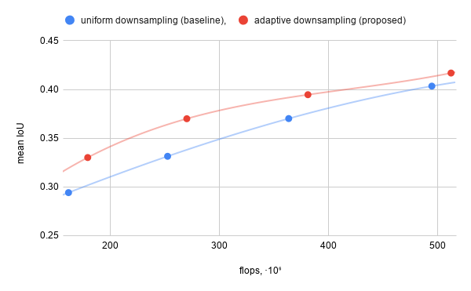

# Efficient Segmentation: Learning Downsampling Near Semantic Boundaries

This is an implementation independently developed by Dmitrii Marin based on open materials
([arXiv:1907.07156](https://arxiv.org/abs/1907.07156)). If you find the code useful for your 
research, please consider citing our latest publication:

* Dmitrii Marin, Zijian He, Peter Vajda, Priyam Chatterjee, Sam Tsai, Fei Yang, Yuri Boykov. 
**Efficient Segmentation: Learning Downsampling Near Semantic Boundaries.** *In International Conference on Computer Vision (ICCV)*, 2019

```
@InProceedings{marin2019efficient,
  author = {Dmitrii Marin, Zijian He, Peter Vajda, Priyam Chatterjee, Sam Tsai, Fei Yang, Yuri Boykov},
  title = {Efficient Segmentation: Learning Downsampling Near Semantic Boundaries},
  booktitle = {IEEE International Conference on Computer Vision (ICCV)},
  year = {2019},
}
```

### MobileNetV2 results



## Training

The very first step is to download the CityScapes dataset and convert it to tensorflow records format. See [here](research/deeplab/g3doc/cityscapes.md)

### Training Sampling Near Semantic Boundaries


#### - Prerequisite 

Compile the module that produces sampling locations from ground truth boundaries (Eq.2 in the paper).
```
cd research/deeplab/utils/nus
sh build.sh
```
You will need CMake, [Ceres Solver](http://ceres-solver.org/), Cython and a C++ compiler.

#### - Training

To train the auxiliary network predicting adaptive sampling location run
```
bash -x test_nus_mobilenetv2.sh
```

To evaluate MSE on the validation set run
```
bash -x eval_nus_mobilenetv2.sh
```

### Training Segmentation

To train a MobileNetV2 model with our adaptive downsampling (to resolution 192x192) on cityscapes dataset run
```
CUDA_VISIBLE_DEVICES=0 SAMPLING_SIZE=192 bash -x test_mobilenetv2_with_nus.sh
```
To start an infinite loop evaluating checkpoints run 
```
CUDA_VISIBLE_DEVICES= MODE=EVAL SAMPLING_SIZE=192 bash -x test_mobilenetv2_with_nus.sh
```

#### Baseline
```
CUDA_VISIBLE_DEVICES=1 SAMPLING_SIZE=192 UNIFORM=1 bash -x test_mobilenetv2_with_nus.sh
CUDA_VISIBLE_DEVICES= MODE=EVAL SAMPLING_SIZE=192 UNIFORM=1 bash -x test_mobilenetv2_with_nus.sh
```

## Changes with respect to the approach in the [paper](https://arxiv.org/abs/1907.07156v1)

* The base model is Deeplabv3 with [MobileNetv2](https://arxiv.org/abs/1801.04381) backbone. The original paper uses 
[PSP-Net](https://arxiv.org/abs/1612.01105), [Deeplabv3+ with Xception](https://github.com/tensorflow/models/tree/master/research/deeplab) and 
[U-Net](https://arxiv.org/abs/1505.04597).

* The auxiliary network is MobileNetv2 with reduced number of channels 
and reduced input resolution. The original paper uses two stacked U-Net models.

## Acknowledgements  

The implementation is based of the DeepLab v3 implementation hosted at
[Tensorflow's models repository](https://github.com/tensorflow/models). 
For compactness we have removed parts unused in our implementation.

## License

[Apache License 2.0](LICENSE)
